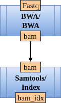
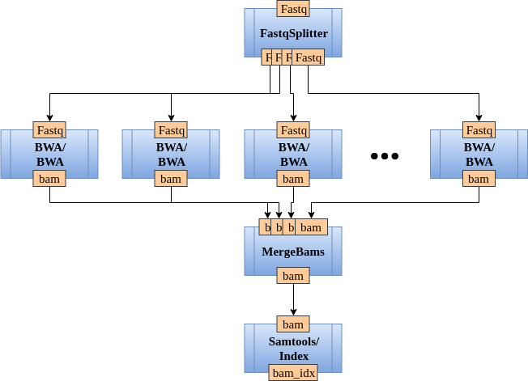

# Advanced topics

## Pipeline configuration

## Splittting and Merging tasks

In **CloudConductor**, a large task can be processed as multiple smaller tasks using ***splitters*** and ***mergers***.
In order to define a splitter and merger, please follow the instructions specified in [module creation](Developers.html#module) from developer's guide.

An example use for splitters and mergers is processing the sequencing reads.
The input sequencing reads can be aligned independently, thus the aligning procedure can run in parallel.
For example, consider the simple pipeline presented in **Figure 2**.

<figure align="center">
    
    <figcaption><b>Figure 2.</b> An example of a small pipeline</figcaption>
</figure>

The graph configuration file for the pipeline presented in **Figure 2** is:

```ini
    [align_reads]
        module=BWA
        final_output=bam

    [bam_indexing]
        module=Samtools
        submodule=Index
        docker_image=Samtools_docker
        input_from=align_reads
        final_output=bam_idx
```

However, after implementing a `.fastq` file splitter and a `.bam` file merger, the new pipeline can be changed as presented in **Figure 3**.

<figure align="center">
    
    <figcaption><b>Figure 3.</b> An example of a parallel and fast pipeline</figcaption>
</figure>

... and the final graph configuration file becomes:

```ini
    [split_reads]
        module=FastqSplitter

    [align_reads]
        module=BWA
        input_from=split_reads

    [merge_align]
        module=MergeBams
        input_from=align_reads
        final_output=bam

    [bam_indexing]
        module=Samtools
        submodule=Index
        docker_image=Samtools_docker
        input_from=align_reads
        final_output=bam_idx
```

As you can observe, in the pipeline definition the new splitter and merger have been added as simple modules.
An important thing to notice is that the ***final_output*** has been moved from *align_reads* to *merge_align*.
If the ***final_output*** was declared at the level of *align_reads*, a set of all splitted alignments (not the final merged result) will be considered as final alignment result.

## Additional configurationg for a pipeline

There are cases when in a specific pipeline run the user wants to override a setting (most times a constant) in a tool.
You can do that as well in the pipeline graph using the ***args*** subsection.
For example, let's say we would like to override the default value of the constants **`MINLEN`** and **`SLIDINGWINDOW_SIZE`** from `Trimmomatic`.
In this case, the pipeline graph looks as following:

```ini
    [trim_reads]
        module=Trimmomatic
        docker_image=Trimmomatic_docker
        [[args]]
            MINLEN=20
            SLIDINGWINDOW_SIZE=5
```

These changes will affect only the CloudConductor runs that use the above pipeline graph.

## Resource kit configuration

## In resource kit Dockers can have more than one resource

There are (not recommended) situations when a Docker contains two separate tools as a command requires piping from one command to another.
You can solve this problem by simply defining additional resources in a Docker image.

For example, the aligning output of `BWA` is in *SAM* format, so to convert it to a more efficient format, *BAM*, we are piping the output from `BWA` to `Samtools` to convert the output format.
Thus, we are required to have a Docker image that has both tools. Here is how you define this situation in a resource kit:

```ini
[Docker]
    [[bwa]]
        image = thd7/bwasam:v.20180522
        [[[bwa]]]
            resource_type = bwa
            path = bwa
    
        [[[samtools]]]
            resource_type = samtools
            path = samtools
```

## In resource kit, multiple definitions of the same resource, the user can select only one

There are situations in which the user can have different definitions of the same resource type in the resource kit.
For instance, the analysis pipeline requires two different versions of the same tool.
This resource kit implementation will raise an error as CloudConductor cannot decide which resource definition of the
same resource type to choose from. Consequently, the user has to specify in the pipeline graph the exact resource name that they require.

Consider this part of a resource kit implementation as an example:

```ini
[Path]
    ...
    [[samtools_0.19]]
        resource_type=samtools
        path=samtools
        containing_dir=gs://path/to/samtools_0.19
    [[samtools_1.3]]
        resource_type=samtools
        path=samtools
        containing_dir=gs://path/to/samtools_1.3
    ...
```

... and the implementation of the pipeline graph using the above resource kit:

```ini
    ...
    [align_reads]
        module=BWA
        final_output=bam

    [bam_indexing]
        module=Samtools
        submodule=Index
        input_from=align_reads
        final_output=bam_idx
        [[args]]
            samtools=samtools_0.19

    [bam_summary]
        module=Samtools
        submodule=Flagstat
        input_from=align_reads
        final_output=flagstat
        [[args]]
            samtools=samtools_1.3
    ...
```

## Platform configuration
