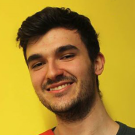
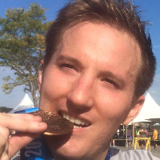

# Authors

## Razvan Panea

Razvan Ioan Panea is a fifth year PhD Candidate in Computational Biology and Bioinformatics at Duke University.
He finished his undergraduate studies in Applied and Computational Mathematics specializing in Computational Biology at Jacobs University Bremen, Germany. 
His main interest is optimizing and enhancing researchers' analysis experience through data science and engineering.

## Alex Waldrop

Alex Waldrop is bioinformatics scientist and Python developer at Duke University.
He has a PhD in Integrative Life Sciences with a focus in computational biology from Virginia Commonwealth University and a BS in Computer Science from Centre College.
His research focuses on applications of sequence data analysis to biological systems and the development of cloud-based solutions to facilitate large-scale data processing and analysis. 

## Tushar Dave

Tushar Dave is a bioinformatician and Python/Perl developer in the Dave lab at Duke University.
He has a master's degree in Bioinformatics from San Diego State University and a bachelors degree in Biomedical and Instrumentation Engineering from U.V. Patel College of Engineering, Ganpat University.
His research focuses on understanding the genetic basis of blood cancers and developing cloud-based solutions for processing and analyzing large-scale bioinformatics datasets. 

