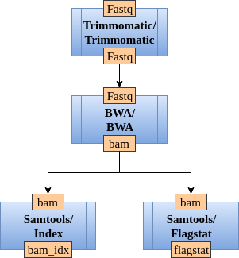

# Creating a workflow

In bioinformatics, a pipeline is defined as a sequence of bioinformatics tools that transform and analyze the input data. 
A pipeline in CloudConductor is representes as a directed graph of modules, where a module is a bioinformatics tool.
Consider **Figure 1** as an example of a pipeline.

<figure align="center">
    
    <figcaption><b>Figure 1.</b> An example of a pipeline</figcaption>
</figure>

Before we explain how to define a pipeline, let's first describe how to define a module in a pipeline.

## Modules

A module is a bioinformatics tool and a submodule is a function that a bioinformatics tool is performing.
Some bioinformatics tools have only one function, thus their modules have only one submodule.
In **Figure 1**, `Samtools` is a module with two submodules: `Index` and `Flagstat`, while `BWA` is one module with one submodule with the same name.
Modules and submodules are predefined. [Here](#available-modules) is a list of currently available modules and submodules.
Please read the advanced topics if you would like to define your own modules and submodules

In a pipeline, a pipeline step is defined using the keywords ***module*** and ***submodule*** as following:

    [*unique_name_of_pipeline_step*]
        module=*name_of_module*
        submodule=*name_of_submodule_used*

Each submodule is defined by a set of *input keys*, *output keys* and a *command*. 
The submodule is running the *command* on the *input keys* and generates output as *output_keys*.
In **Figure 1**, submodule `Index` from module `Samtools` has 
one input key ("*bam*" - the input BAM file) and one output key ("*bam_idx*" - the output BAM index file).

You can specify to keep an output file generated by a module using the keyword ***final_output*** in the module definition. 
For example, if you want to keep the indexed file after running `samtools index` you would define the module as following:

    [bam_indexing]
        module=Samtools
        submodule=Index
        final_output=bam_idx

Additionally, using the keyword ***docker_image*** you are able to specify which Docker image from resource kit you want CloudConductor to use.
If no ***docker_image*** is specified, then the tool executable is obtain from the external resources list from resource kit.

More information about resources and Docker will be presented in the definition of the resource kit.

## Create a pipeline graph

To create a pipeline graph, you need to connect the modules using the keyword ***input_from***.
For example, in **Figure 1**, BWA receives the *input from* Trimmomatic.

The value of an ***input_from*** key is a set of defined unique *pipeline steps*.
The pipeline presented in **Figure 1** can be represented as following:

    [trim_reads]
        module=Trimmomatic
        docker_image=Trimmomatic_docker

    [align_reads]
        module=BWA
        input_from=trim_reads
        final_output=bam

    [bam_indexing]
        module=Samtools
        submodule=Index
        docker_image=Samtools_docker
        input_from=align_reads
        final_output=bam_idx

    [bam_summary]
        module=Samtools
        submodule=Flagstat
        docker_image=Samtools_docker
        input_from=align_reads
        final_output=flagstat

As you can observe, there is no need to specify the submodules for `Trimmomatic` or `BWA` as they have only one submodule with the same name.
Also, we decided to not keep the output of Trimmomatic, but you can always add *fastq* as ***final_output*** to keep it.

## Available modules

Here is a list of currently implemented modules and their description.
